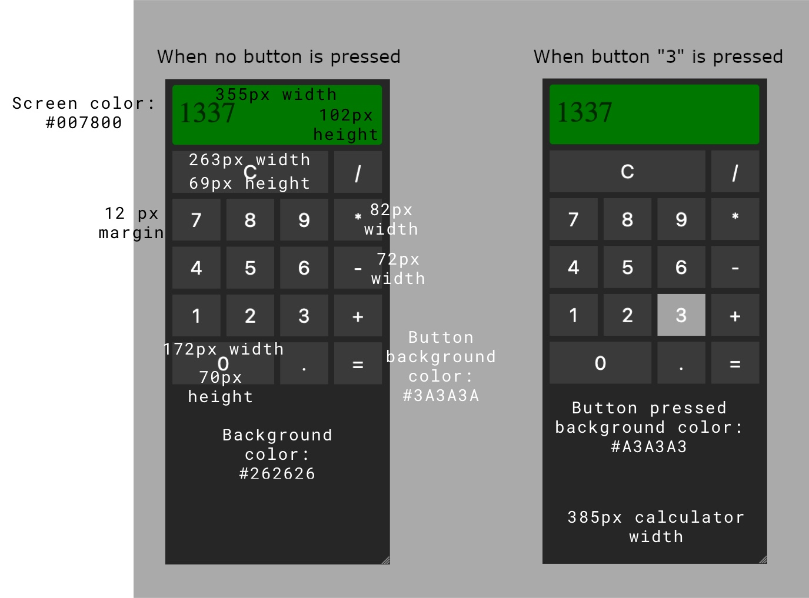
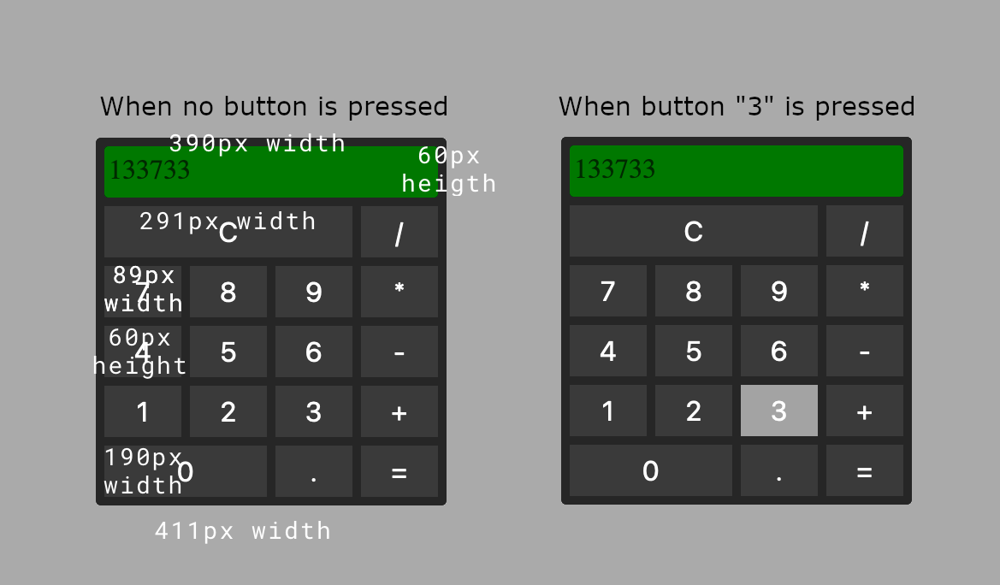

# HOW TO READ MY TEST

This repository has multiple branches. The master branch with the final answers to the test questions and several branches with the name step-X (step-0, step-1, step-3, etc ...). Each step is a decision I made to reach the final solution, so to understand how I work and how I code, instead of seeing the complete solution, I recommend that you start with the step-0 branch and after step-1 . and continue until the last step.

Hope you like the way I see the software ...

# STEP-0: Analising the desings
I have chosen to try to solve problems one and two. The reason is simple; the second part of the test, as well as problems three and four, focus on JavaScript skills, so if I don't solve problems one and two, I will miss the opportunity to show my CSS skills.

So once I've decided to focus on problem one and two the question is which of them I'll solve first. The answer is the second and the reason is because, in desing, to go from the most restrictive condition to the most permisive is easer than in the other way. You can read about the [Mobile first principle in this article](https://medium.com/@Vincentxia77/what-is-mobile-first-design-why-its-important-how-to-make-it-7d3cf2e29d00). But before I start designing the website, I need to calculate the colors and sizes of the different elements in the view. So I opened up my Sketch tool and got all this information from the mockups that were included in the project:



Now I'm ready to start with the code.

# STEP-1: Mobile view
The goal of this step is to add the CSS styles for the mobile view. For that I will use the measurements that I took from the image of the mobile mockup in the previous step. Before I started, I knew from experience that measurements are most likely not as accurate as they should be. When I take the styles of a website from images, there are always small errors that, in the end, make the whole view not look so good. So for easy adjustments I put all measurements in css variables:

```css
:root {
  --calcultor-mobile-width: 385px;
  --display-mobile-height: 102px;
  --display-mobile-font-size: 42px;
  --display-font-color: #000000;
  --diplay-background-color: #007800;
  --color-background-calculator: #262626;
  --calculator-margin: 12px;
  --general-border-radius: 4px;
  --button-margin: 6px;
  --button-mobile-width: 84px;
  --button-mobile-height: 82px;
  --button-font-size: 31px;
  --button-font-color: #ffffff;
  --button-background-color: #3A3A3A;
  --button-press-background-color: #A3A3A3;
  --button-clear-mobile-width: 277px;
  --button-0-mobile-width: 181px;
}
```

That way, I have all the measurements taken in one place, which helps a lot when adjustments need to be made.

Now let's talk about the button grid. For me, the easiest way to make a grid is using the flex box. For that, what I need is to declare a fixed width for the whole calculator:

```css
.calculator {
  width: var(--calcultor-mobile-width); /*<-- fixed width for the calculator */
  background-color: var(--color-background-calculator);
  margin-left: auto;
  margin-right: auto;
  padding: var(--calculator-margin);
  border-radius: var(--general-border-radius);
}
```

And a fixed width for the buttons

```css
.calc-button {
  height: var(--button-mobile-height);
  width: var(--button-mobile-width); /*<-- fixed width for the buttons*/
  margin: var(--button-margin);
  border-radius: var(--general-border-radius);
  background-color: var(--button-background-color);
  font-size: var(--button-font-size);
  color: var(--button-font-color);
}
```

After that I put the buttons inside a div which will be the calculator button grid and changed their order to be the same as the mockup:

```html
 <div class="keyboard"> <!-- This div will be the keyboard grid -->
    <button class="calc-button" id="btn-clear">C</button> <!-- The order of the buttons is the same as that of the mockup. -->
    <button class="calc-button" id="btn-divide">/</button><!-- The buttons are from the calc-button class which has all the common -->
    <button class="calc-button" id="btn-7">7</button>     <!-- CSS styles for calculator buttons -->
    <button class="calc-button" id="btn-8">8</button>
    <button class="calc-button" id="btn-9">9</button>
    <button class="calc-button" id="btn-multiply">*</button>
    <button class="calc-button" id="btn-4">4</button>
    <button class="calc-button" id="btn-5">5</button>
    <button class="calc-button" id="btn-6">6</button>
    <button class="calc-button" id="btn-subtract">-</button>
    <button class="calc-button" id="btn-1">1</button>
    <button class="calc-button" id="btn-2">2</button>
    <button class="calc-button" id="btn-3">3</button>
    <button class="calc-button" id="btn-add">+</button>
    <button class="calc-button" id="btn-0">0</button>
    <button class="calc-button" id="btn-separator">.</button>
    <button class="calc-button" id="btn-calculate">=</button>
  </div>
```
The keyboard div will be a wrapped flex screen. That means the browser will display all buttons on the same line until there is no room for the next button. In that case, the browser will place the next button on the next line and so on. That way we can create a perfectly aligned button grid:

```css
.keyboard {
  width: 100%;
  display: flex;
  flex-wrap: wrap; /*<-- this is the key for the buttons grid */
  justify-content: center;
  align-items: center;
}
```

The only thing left to make the grid the same as the mockup is to change the width of the clear and 0 buttons because they are larger than the other buttons. To do that, the only thing I need to do is overwrite the CSS width using the id selector:

```css
#btn-clear {
  width: var(--button-clear-mobile-width); /* <-- width for the clear button */
}

#btn-0 {
  width: var(--button-0-mobile-width); /* <-- width for the 0 button */
}
```

And finally, the button pressed. In the mockup, the button that was clicked has a different background than the rest of the buttons. If a button is clicked, it means that it has the current focus of the browser. So ... all we have to do is overwrite the background color on the button that has the focus:

```css
.calc-button:focus {
  outline: none; /*<-- It removes the default style of the button when it has the focus */
  background-color: var(--button-press-background-color); /* <-- Overwrite the background color with the focus */
}
```

# STEP-2: Keyboard interactive

In this step, I will make the calculator accessible using the computer keyboard. So the first thing is the DRY rule (Do not repeat yourself) and that means I have to move all the logic that fires when a button is clicked into independent functions that I can reuse when the user presses a key:

```javascript
// Function that prints a digit in the calculator screen
function digitPressed(digit) {
    return () => { elements.display.textContent += digit; }
}

// Function that prints the decimal separator in the calculator screen
function separatorPressed() {
    const text = elements.display.textContent;
    if (text.length && text.indexOf(".") === -1) {
        elements.display.textContent += ".";
    }
}

// Function that clears the calculator screen
function clearPressed() {
    elements.display.textContent = "";
    stored = null;
}

// Function that adds an operation when an operation button is clicked
function operationPressed(opCode) {
    return () => {
        stored = {
            text: stored ? calculate() : elements.display.textContent,
            opCode
        };
        elements.display.textContent = "";
    }
}

// Function that gets the result of the operation
function calculatePressed() {
    if (!stored) {
        return;
    }
    elements.display.textContent = calculate();
    stored = null;
}
```
Once I extract the business logic for the buttons into separate functions, I have to change the click events to execute those functions.

```javascript
function setUpEntryButtons() {
    for (let [digit, button] of Object.entries(elements.digitButtons)) {
        button.addEventListener("click", digitPressed(digit)); //<-- call the new function
    }

    elements.separatorButton.addEventListener("click", separatorPressed);//<-- call the new function

    elements.clearButton.addEventListener("click", clearPressed);//<-- call the new function
}

function setUpOperationButtons() {
    for (let [opCode, button] of Object.entries(elements.operationButtons))
        button.addEventListener("click", operationPressed(opCode));//<-- call the new function
}

function setUpCalculateButton() {
    elements.calculateButton.addEventListener("click", calculatePressed);//<-- call the new function
}
```
Now that I have the separate business logic, I can focus on writing the function that sets the keyboard event to execute this business logic:

```javascript
function setUpKeyboardEvents () {
    /*
      From my point of view a map with all the html buttons for operations is a solution more elegant than a switch or a nested if
    */
    const opElements = {
        '+': document.getElementById('btn-add'),
        '-': document.getElementById('btn-subtract'),
        '*': document.getElementById('btn-multiply'),
        '/': document.getElementById('btn-divide'),
    }

    document.addEventListener('keypress', function keyEvenPressed (event) {
        /*
         This preventDefault prevents errors when trying to calculate the result of an operation. How pressing a button means moving the focus of the browser to this button, if we do not execute preventDefault two actions will occur when the user presses the Enter key:
            * A button click event with focus will be fired first. That usually ends with an unexpected extra number in the second operand.
            * Second, the result of the operation is displayed on the calculator screen, but it is an wrong result because our enter event has added a new number to the end of the second operarand.
          
           This is why this event.preventDefault is so important
        */
        event.preventDefault();
        if (digits.includes(event.key)) {
            // Code run when a digit key is pressed
            document.getElementById(`btn-${event.key}`).focus();
            digitPressed(event.key)();
        } else if (event.key === '.') {
            // Code run when the point key is pressed
            document.getElementById('btn-separator').focus();
            separatorPressed();
        } else if ((event.key === 'c') || (event.key === 'C')) {
            /*
             The code executes when the "c" or "C" key is pressed. I thought it would be nice to clear the calculator screen when the user presses c because the clear button has a "C" printed on it.
            */
            document.getElementById('btn-clear').focus();
            clearPressed();
        } else if (Object.keys(operations).includes(event.key)) {
            // Code run when the user press a operation key
            opElements[event.key].focus();
            operationPressed(event.key)();
        } else if ((event.key === '=') || (event.key === 'Enter')) {
            /*
              Code run when the user press the key "=" or Enter. Same reason than the clear button. The key to calculate the result of the operation has an "=" sign so I thought that it could be intuitive for the user that the result of the operation gets calculated when the user press the "=" in the same way that happen when it press Enter
            */
            document.getElementById('btn-calculate').focus();
            calculatePressed();
        }
    });

    /*
      The backspace key is not a printable key so the event "keypress" doesn't work for it. For this reason I had to listen another key event just for the backspace
    */
    document.addEventListener('keyup', function keyEventBackspace (event) {
        event.preventDefault();
        if (event.key === 'Backspace') {
            document.getElementById('btn-clear').focus();
            clearPressed();
        }
    });
}
```

# STEP-3: Swipes
In this step, I'll add the swipe left action to clear the calculator screen. To do this, I will create a "setMoveSwipe" function that will capture finger movements on the calculator display to decide whether or not a left swipe has occurred:

```javascript
function setMoveSwipe() { 
    // This variable will store the position of the finger in the X axis when the user touch the calculator display
    let xDown = null;

    /*
      Here I listen to the touchstart event on the calculator screen and save the position of the finger in the variable xDown
    */
    elements.display.addEventListener('touchstart', function handleTouchStart (event) {
        const firstTouch = event.touches[0];
        xDown = firstTouch.clientX;
    }, false);

    // Here I listen the touchmove event that is fired when the finger moves on the calculator screen
    elements.display.addEventListener('touchmove', function handleTouchMove(event) {
        if (!xDown) {
            return;
        }

        /*
            The logic is easy, if the user moves his finger from right to left it means that the position on the X axis when the user touches the screen is greater than the current position of the finger on the X axis. So what I have to do in this function is to get the current position of the finger. If this position is lower than the previous one, then this is when I have to clear the calculator screen.
        */
        const xUp = event.touches[0].clientX;

        if (xDown > xUp) {
            document.getElementById('btn-clear').focus();
            clearPressed();
        }

    }, false);
}
```

# STEP-4: Desktop version
As I did in step-0, before modifying the style, I took the mockup from the desktop version and tried to pull out all the sizes that are different from the mobile version:



Once I get the measurements, I added these values to the css variables that I created in step 1:

```css
:root {
    --calcultor-mobile-width: 385px;
    --calculator-desktop-width: 411px; /* <-- calulator width for desktop version*/
    --display-mobile-height: 102px;
    --display-desktop-height: 60px; /* <-- display height for desktop version*/
    --display-mobile-font-size: 42px;
    --display-font-color: #000000;
    --diplay-background-color: #007800;
    --color-background-calculator: #262626;
    --calculator-margin: 12px;
    --general-border-radius: 4px;
    --button-margin: 6px;
    --button-mobile-width: 84px;
    --button-desktop-width: 89px; /* <-- button width for desktop version */
    --button-mobile-height: 82px;
    --button-desktop-height: 60px; /* <-- button height for desktop version */
    --button-font-size: 31px;
    --button-font-color: #ffffff;
    --button-background-color: #3A3A3A;
    --button-press-background-color: #A3A3A3;
    --button-clear-mobile-width: 277px;
    --button-clear-desktop-width: 291px; /* <-- button clear width for desktop version */
    --button-0-mobile-width: 181px;
    --button-0-desktop-width: 190px; /* <-- button 0 width for desktop version */
}
```

After that I created a media query to overwrite the default mobile css values with the desktop values if the screen width is equal to or greater than 768px; As the requirements of problem one indicate:

```css
@media(min-width: 768px) {
    .calculator {
      width: var(--calculator-desktop-width); /* <-- Overwrite the width of the calculator*/
    }

    #display {
      height: var(--display-desktop-height); /* <-- Overwrite the height of the calculator display*/
    }

    .calc-button {
      width: var(--button-desktop-width); /* <-- Overwrite the width of the buttons */
      height: var(--button-desktop-height); /* <-- Overwrite the height of the buttons */
    }

    #btn-clear {
      width: var(--button-clear-desktop-width); /* <-- Overwrite the width of the clear button */
    }

    #btn-0 {
      width: var(--button-0-desktop-width); /* <-- Overwrite the width of the 0 button */
    }
}
```

# STEP-5: Components
The only thing left to finish the test is to see if I can improve the current code in some way. Being honest, I don't think I can write better code for a one page website. I mean ... the index.js is well structured and the solution is tailored to the requirements. The only point that I think could be improved is the separation by responsibility. I mean ... everything, visual logic and business logic are together and mixed in index.js. It's not a big deal because the app is small, but if I start adding more operations and buttons to the calculator, I'm pretty sure it will be hard to maintain before version 5 or 6. So, to make the app more sustainable and easy to add new features, I will use custom components to separate the visual logic from the business logic. Maybe it's a bit of a overdoing for this test, but seriously, I can't think of another change that could be a significant improvement for this web app.

So what I did was create another project in another repository called [calculator-view](https://github.com/ardiadrianadri/calculator-view). This repository is a project of lit-element libraries, which is the main library for creating standard custom components. To be clear, when I said "standard custom components", I mean that the package resulting from the compilation of this project can work in any web application, including the calculator, without the need for anything else other than the browser itself. This is the main reason why I chose this technology to create the components. 

At the end what I have is a js file called calculator-view.bundled.js which contains two custom components. The first one is the calculator-view. This component have a input attribute which expects to recive an array of buttons objects like this:

```js
const buttons = [
        {
          label: 'C',
          type: 'clear',
          value: 'clear',
          size: 'big',
          keys: ['c', 'C', 'Backspace']
        },
        {
          label: '/',
          type: 'operation',
          value: 'divide',
          size: 'small',
          keys: ['/']
        },
        {
          label: '7',
          type: 'number',
          value: '7',
          size: 'small',
          keys: ['7']
        },
        {
          label: '8',
          type: 'number',
          value: '8',
          size: 'small',
          keys: ['8']
        },{
          label: '9',
          type: 'number',
          value: '9',
          size: 'small',
          keys: ['9']
        },{
          label: '*',
          type: 'operation',
          value: 'multiply',
          size: 'small',
          keys: ['*']
        },{
          label: '4',
          type: 'number',
          value: '4',
          size: 'small',
          keys: ['4']
        },{
          label: '5',
          type: 'number',
          value: '5',
          size: 'small',
          keys: ['5']
        },{
          label: '6',
          type: 'number',
          value: '6',
          size: 'small',
          keys: ['6']
        },{
          label: '-',
          type: 'operation',
          value: 'subtract',
          size: 'small',
          keys: ['-']
        },{
          label: '1',
          type: 'number',
          value: '1',
          size: 'small',
          keys: ['1']
        },{
          label: '2',
          type: 'number',
          value: '2',
          size: 'small',
          keys: ['2']
        },{
          label: '3',
          type: 'number',
          value: '3',
          size: 'small',
          keys: ['3']
        },{
          label: '+',
          type: 'operation',
          value: 'add',
          size: 'small',
          keys: ['+']
        },{
          label: '0',
          type: 'number',
          value: '0',
          size: 'medium',
          keys: ['0']
        },{
          label: '.',
          type: 'number',
          value: '.',
          size: 'small',
          keys: ['.']
        },{
          label: '=',
          type: 'operation',
          value: 'calculate',
          size: 'small',
          keys: ['=', 'Enter']
        }
    ];
```

Each object in the array represent a button in the calculator and it has five attributes:

* **label**: It is the text that will be rendered inside the button
* **type**: Indicates if the button store a number, an operation or it is the clear button
* **value**: It is the value sent in the custom events
* **size**: It is the size of the button width. It can be small, medium or big
* **keys**: An array of the computer keys that activate the button

The calculator-view doesn't perform any operation. It only gets the input parameters and emit and event each time the user press an operation button. Nothing more and nothing less. It represent the visual logic

The other component is the calculator-logic. It is a component that does not render any HTML. It only performs calculator operations. To do this, it gets as input an object with the calculator's screen value and an operation to apply to the value. Each time it gets a new input, the calculator-logic gets the last number, applies the last operation to the current number and the last number, and stores the result in a private attribute. If the operation it receives is the "calculate" action, it fires a custom event to return the final result of all operations.

The way these two components work together is simple. At the html level they only need to be in the same body:
```html
<calculator-view id="calc-view"></calculator-view>
<calculator-logic id="calc-logic"></calculator-logic>
```

In the index.js we must ensure communication between their events. First we get the calculator-view component, give it the list of buttons and listen to its calc-event:

```javascript
const calculatorComponent = document.getElementById('calc-view');
calculatorComponent.setAttribute('buttons', JSON.stringify(buttons));
calculatorComponent.addEventListener('calc-event', onCalculatorViewEvent);
```

Every time the * calc-event * is fired, we must take the number and the operation within the event detail and give them to the calculator-logic:

```javascript
function onCalculatorViewEvent(event) {
  const operation = {
    number: event.detail.number,
    operation: event.detail.operation
  }

  calculatorLogic.setAttribute('calculation', JSON.stringify(operation));
}
```
On the other hand, we have to listen to the event result of the calculator-logic:

```javascript
const calculatorLogic = document.getElementById('calc-logic');
calculatorLogic.addEventListener('result', onCalculationResult);
```
When the result event is fired we must take the value of the event and put it in the calculator-view display:

```javascript
function onCalculationResult(event) {
  calculatorComponent.setAttribute('calculatorDisplay', event.detail.result);
}
```

And that's it. The advantages of this approach are that the calculator is easier to maintain and expand. If we want to add new buttons, all we have to do is add new objects within the button matrix ... and this change does not affect the operation of the calculator-logic in any way. On the other hand, adding more operation only involves calculator-logic. It does not affect how the calculator-view works.
